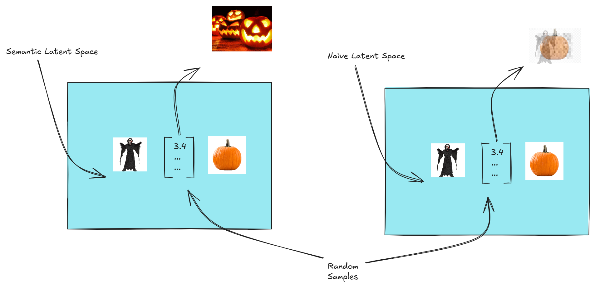
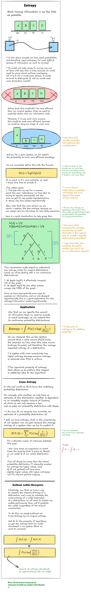
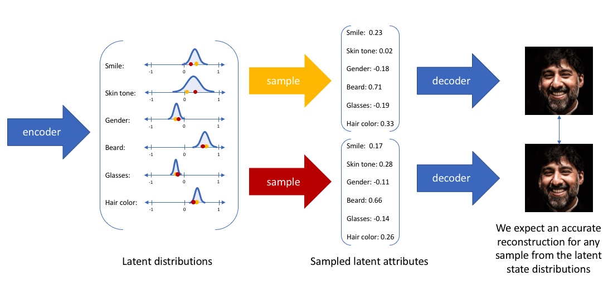

# Latent variable models

> VAE's are a type of latent-variable model, and we will be using this probabilistic perspective throughout our generative AI journey!

### Intro: AutoEncoders:
Learn to encode and reconstruct an image with a 'bottleneck', which is our latent-vector/latent-space variables

- When we train our autoencoder, our Neural net is able to deconstruct and reconstruct images, however when we try to sample new images from our 'latent distribution', we get blurred and odd pixels (our space is unstructured)

- We want  need to guide our model to be aware of the dependencies between 'similar' images/classes of images

- So, ***how do we make our latent spacae mean something?*** If we could capture complex semantic relationships in our space (IE: move right for happy, left for sad, up for guy, down for girl), we could get one step closer to generating images

>
> Below is an illustration of what we hope or latent space would encode vs. what a naive one would:

We can see how having a meaningful latent space in an autoencoder would allow us to generate meaningful images if we sampled from the space.

--------------------------------------------------------------------------

# Probabilistic approach w/ latent variable models

----------------------------------------------------------

## Entrop and KL divergence:

- Entropy is a concept related to the field of information theory, and is an important way that we can describe the uncertainty or 'surprise' of systems

- We will use this idea to quantify how well our model works, and for other things as well later on

- Read this out for a more full understanding:

-------------------------------------------------------------------------------------

## Regular Autoencoders

Regular autoencoders are able to find lower-dimensional 'manifolds' in our data, or find patterns that allow them to represent data in a latent-space, and reconstruct it.

But...
> They only worry about reconstructing data
> Our latent space is inherintly unstructured: we cannot sample from it in any way

## Probabilistic autoencoders
- What if given an image, we could assign probabilities to it with our encoder, and sample from this distribution with our decoder?
- Our model would learn to reconstruct image from sampling a range of values, rather than one value
- This would allow us to sample from our 'stable' latent space, which would be a normal distribution: allowing us to know what values are true and not true!

Basically this is what we can do:
1. Learn a mapping (neural network) p(z|x): probability of each latent variable z given x. We will learn the mean and standard deviation for each z_n
2. Sample from each one of our z's with learned mean and standard deviation
3. With these samples, generate a probability distribution for our pixel-space p(x|z)
- We want to constrain p(z)'s (or p(z|x)'s) to be as close to a normal distribution with mean 0 and std. dev. 1 so our latent-space behaves well, and the model is forced to learn dynamic relationships between data (cat vs. dog vs. submarine --> why cat/dog's are similar!)
- Similar to a regular autoencoder, we want our re-creations of the image to be as close as possible

