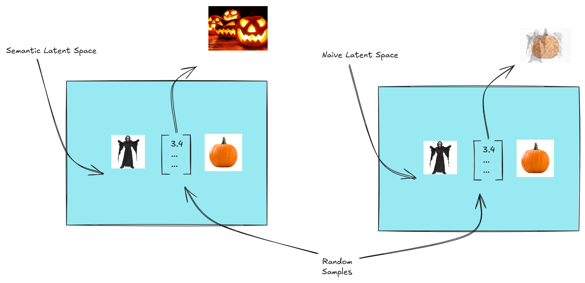

# How do we generate images with, and what even are: Variation Auto Encoders?

### AutoEncoders:
Learn to encode and reconstruct an image with a 'bottleneck', which is our latent-vector/latent-space variables

- When we train the model to do this, it does not capture any meaningful representation in the data. The loss function only requires that the pixels be as close together as possible, not for any meaningful patterns to be captured.

- We need to guide our model to be aware of the dependencies between 'similar' images/classes of images

- So, ***how do we make the corresponding latent variables mean something?*** If we could capture complex relationships between ideas, rather than pixel-perfect representations, we could potentially have a model that could understand how to generate new images based on an idea alone,

> An example of this is as follows: If we randomly sampled from a latent space vector, we would hope to get the average *meaning* of our latent vector, not the average pixel values (useless in this sense)
>
> Below is an illustration of what we hope or latent space would encode vs. what a naive one would:

We can see how having a meaningful latent space in an autoencoder would allow us to generate meaningful images.