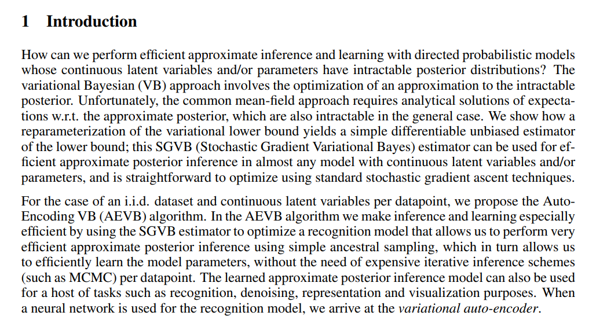

For now, we'll delve straight into a discussion about the maths.

1. We're given a dataset X (usually a dataset of MxN images) with N i.i.d. samples
- i.i.d. ==> independent, identically distributed samples. Each image is taken from the same high-dimensional probability distribution (think of all images have some hidden one), and each image is independent of the other

2. Our samples are generated by a continous random variable *z*.
- *z* are hidden latent variables that are the underlying higher-level 'meaning' of our images. Think about our distribution of images having some deeper/underlying high-level projection.
- z is *continous* and a *random variable* (it can take on any values in a given range)

3. Therefore, a value *z* (underlying probability of image) is generated from a ***prior distribution*** *p(z)*, and then from these latent variables, an image from *p(x|z)* is sampled

- theta denotes parameters mapping p(z) to p(x|z)
- parametric distributions have the same formula, just different parameters. In practice we use normal gaussian distributions.

         Lets think of an example
         1. We have some underlying variables that generate some images (faces), such as: 
         - smile
         - liklehood of being male
         - long hair
         2. We sample from the probability distributions of each variables, think of how given a distribution of heights in a population we can sample from a random height
         3. Given our variables that we sampled, we now draw an image that could have any range of long-hair or smile, depending on how we sampled.
        - We assign a probability distribution to each pixel (p(x|z)) based on p(z)/sampled underlying variables

***We have a problem***: this underlying sampling from p(z) is unknown, and so is p(x|z).

This is an important part of the paper, which introduces the fundamental aims of the probabilstic approach.

Previously it was introduced that p(x) is generated by some p(z) that we cannot observe. 

However, in real problems we have some dataset *X* and we want to be able to model p(z|x), or the probability of z given some data. More specifically, we'd like to maximize the probability p(x) given by our model.

To do this, we need to find p(z|x), which allows us to infer p(z). Then we find p(x|z), and from p(x|z) and p(z) we can comute p(x), and maximize it through the parameters of our model.

However, there are some problems:

1. *Intractability*
- It is stated that we would like to obtain p(x) from our data by integrating z and p(x|z)
    - we already know p(z), and we would like to maximize p(x) (our model assigning real-probabilities to real-examples)
    - we cannot do this with the formula, because it is too computationally expensive to marginalize

* Explanation for marginalizing probability:

        Marginalizing probability is like saying this:
        1. Given we have some z variables and we know their distributions (p(z1,z2,z3)), we can construct a joint-distribution (since independent) of all the z variables
        2. Given that we know p(x1,x2,x3..|z1,z2,z3...), or how z variables affect x variables, we can marginalize out each x_n by integrating the p(z's) joint distribution with p(x|z's) joint distribution

2. We would also like to obtain p(z|x) which is our models distribution *z* given novel samples

